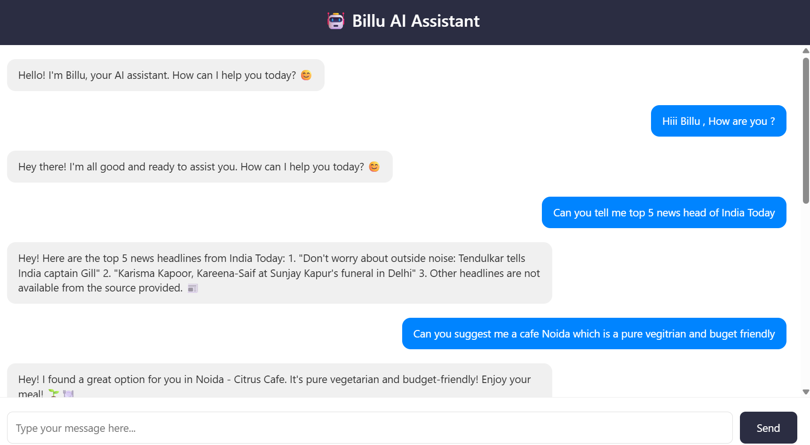
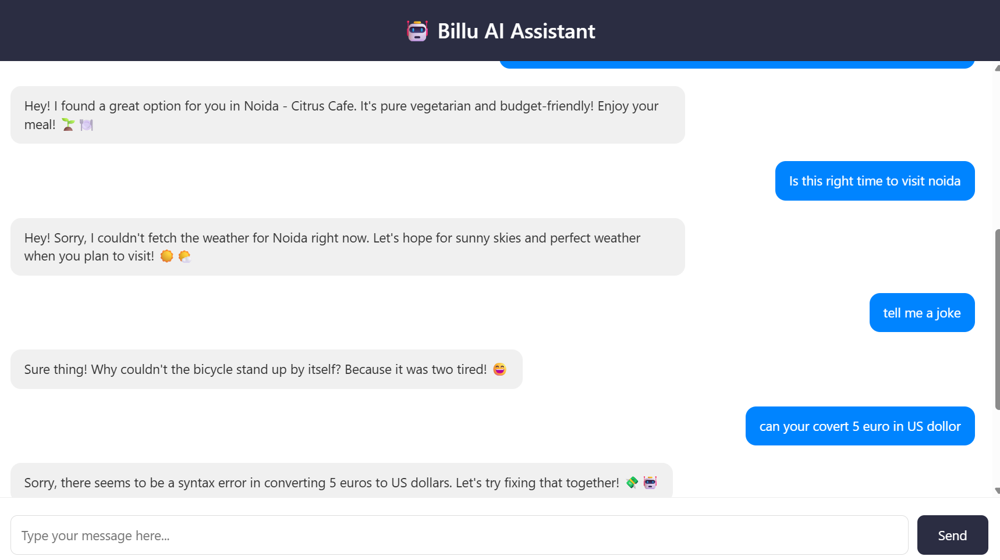
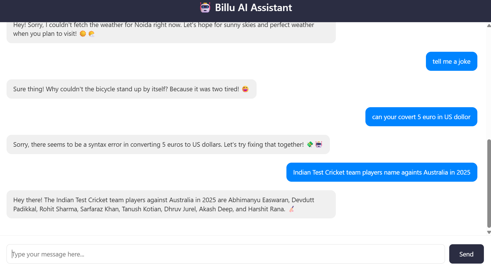
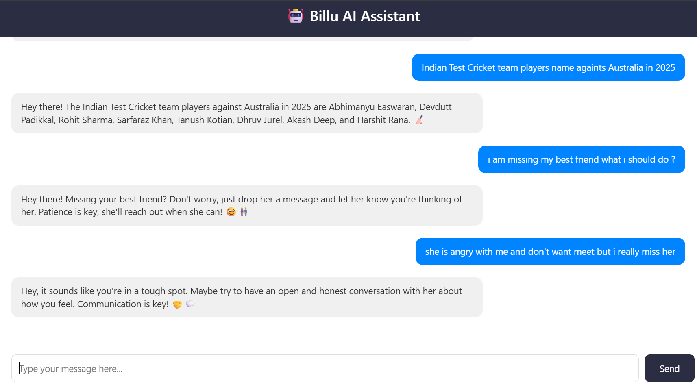

# 🤖 Billu – My First AI Agent (and a pretty smart one!)

**Billu** is my very first AI agent – built to simplify my everyday tasks 🧠💡  
From checking weather updates to fetching the latest news and searching the web smartly, Billu is like that tech-savvy friend who’s always ready to help.

---

## 💼 What Billu Can Do Right Now:

- 📰 **Stay Updated with News**  
  Fetches the latest headlines using [NewsAPI](https://newsapi.org/)

- 🌦️ **Get Real-Time Weather**  
  Provides accurate temperature, humidity, and conditions using [OpenWeather](https://openweathermap.org/)

- 🔎 **Smart Google-Like Search**  
  Uses [SerpAPI](https://serpapi.com/) + LLM to understand and rewrite your query for optimized results

- 🧮 **Solve Math Problems**  
  From basic arithmetic to Python expressions, Billu can calculate on the fly

---

## 🛠️ Tech Stack

| Component      | Tech Used                                      |
|----------------|------------------------------------------------|
| 💬 LLM          | [OpenRouter GPT-3.5](https://openrouter.ai/)   |
| 🧩 Agent Logic  | [LangChain](https://www.langchain.com/)        |
| 🌐 Search       | [SerpAPI](https://serpapi.com/)                |
| 🌦️ Weather      | [OpenWeather API](https://openweathermap.org/) |
| 📰 News         | [NewsAPI](https://newsapi.org/)                |
| 🐍 Language     | Python                                         |

---

## 🚧 Coming Soon

- 📅 **Calendar & Smart Scheduling**
- 🗣️ **Speech Recognition & Voice Output**
- 💼 **Job Search Assistant**
- 📍 **Location Info Lookups**
- 🍳 **Recipe Finder**
- 🎬 **Movie & TV Info Tool**

> Continuous updates planned — Billu is still learning and growing! 💪

---

## 🧠 Why I Built This

Like most of us, I used to jump between apps just to check the weather, browse the news, or search for quick info.  
So I thought – *"What if I build my own AI assistant?"* That’s how Billu was born – as part of my final year project, and now, a personal assistant I actually use.

This isn’t just a chatbot.  
🧠 It understands your query.  
🧰 Picks the best tool.  
📬 And responds like a helpful friend (with emojis too 😄).

---

## 📸 Screenshots 

  

  

  

---

## 🤝 Contributions Welcome!

Have cool ideas? Want to plug in your own tools?  
Feel free to fork, clone, or open a pull request. Let’s build Billu into something amazing 🚀

---

## 📄 License

MIT License – Free to use, improve, and share.

---

## 📬 Let’s Connect

Feel free to reach out if you’re curious or want to collaborate:  
🔗 [LinkedIn](https://www.linkedin.com/in/kashif-kairo)

---

> Made with 💻, ☕, and lots of curiosity by Mohammad Kashif

